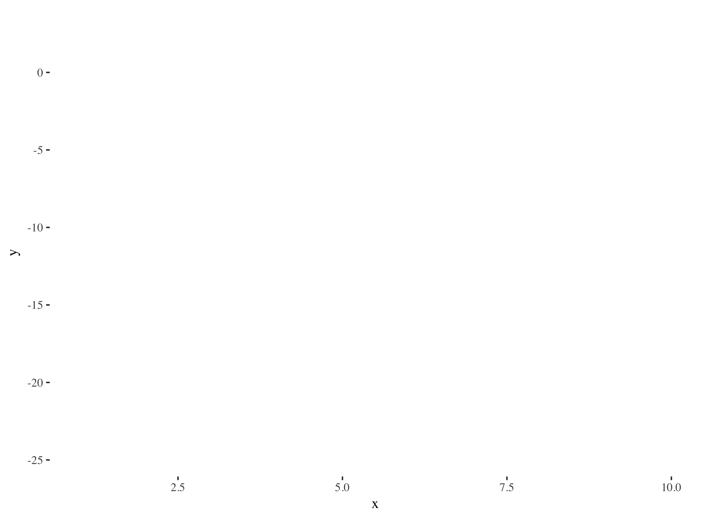
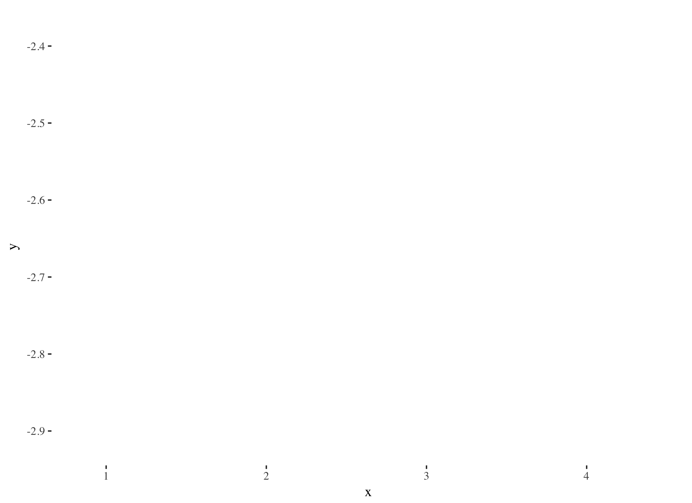

```{r, include=FALSE}
library(tidyverse)
library(Ecdat)
library(ggthemes)
library(prettydoc)
data(Housing)
```

### Basic Setup

Recall our general setup: 

* A **feature space** is an $n$-dimensional real vector space $X$. 
* A **data point** is an element of $X$.
* The components of a data point $x \in X$ are labeled as $x^i$ for $i=1\dots n$, and these components are called **features**. Each feature generally is given a name, and the ordering of them is fixed. 

### Regression

**Regression** is the process of trying to approximate a real-valued function $f: X \rightarrow \mathbb{R}$ defined on a feature space $X$. 

This is a **supervised learning** problem, where we know the values $\{f(x_j) = y_j\}$ for some collection of data points $\{ x_j \}$. The values $\{y_j\}$ are the **target values**, the individual pairs $(x_j, y_j)$ are **training examples** and the set of training examples $\{(x_j, y_j)\}$ form a **training set**.

Our goal is to find the **best** approximation of $f$ by some function $\bar{f}$. We refer to $\bar{f}$ as a **hypothesis** or **hypothesis function**. 

Phrased in this language, the goal of regression is to find the **best hypothesis** that fits the training set.  

### Questions

* What form is the hypothesis allowed to take? 
* What does "best approximation" mean? 
* Given some notion of a "best approximation", is there a unique such approximation?

### What form for the hypothesis?

**Definition:** Let $X^m, Y^n$ be $m, n$-dimensional real vector spaces, respectively. A function $f: X \rightarrow Y$ is **linear** if:

* $f(x+y) = f(x) + f(y)$ for all $x,y \in X$  
* $f(c*x) = c*f(x)$ for all $c \in \mathbb{R}$. 

**Linear regression** assumes that the hypothesis function is linear. 

#### Why linear?

A good question. Some possible answers:

1. Linear functions are very simple. We can manage them easily on computers, and everything in linear algebra can be used to help us. 
2. Many relationships might genuinely be linear, or at roughly linear! Think about physics, where it is actually the case that the force due to an acceleration is a linear function 
$$F = ma$$
3. Calculus. Around a given point $x_0$, any decent function $f: X \rightarrow \mathbb{R}$ is approximated reasonably well by a linear function:
$$f(x) \approx f(x_0) + f'(x_0)(x-x_0). $$

## What does "best approximation" mean?

One way of defining the best hypothesis is to introduce a **cost (or loss) function**. A cost function a function on hypotheses that measures the "cost" of the hypothesis. This function should be such that:

* "high cost" <=> "bad hypothesis"
* "low cost" <=> "good hypothesis"

One class of cost functions are those that aggregate some penalty that is a function of the discrepancy between the values of $f$ on the training set and the values of the hypothesis on the training set. The idea is to penalize large errors on the training set, and to incur no cost if the hypothesis matches the training set perfectly. 

### Ordinary Least Squares

For regression problems, a common choice of cost function is the squared loss function:

$$J(\bar{f}) = \frac{1}{2} \sum_{j=1}^k (f(j) - \bar{f}(x_j))^2  = \frac{1}{2} \sum_{j=1}^k (y_j - \bar{f}(x_j))^2$$

How does this behave?

* If $\bar{f}(x_j) = y_j$ for all $j$, then $J(\bar{f}) = 0$, and there is no cost.
* Generally, the worse that $\bar{f}$ is at predicting the values $y_j$, the worse that $J(\bar{f}), but the behavior is complicated. For a training set with a single data point, the loss as a function of the difference between $y_1$ and $\bar{f}(x_1)$ is a parabola:

```{r, echo=FALSE, message=FALSE, warning=FALSE}
data.frame(x=-10:10, y=sapply(-10:10, function(x) x**2)) %>% ggplot(aes(x=x,y=y)) + geom_smooth() + xlab("Difference between hypothesis and value.") + ylab("Cost") + theme_tufte()
```

#### Things to think about: 
   * How does this loss function behave if $f$ is linear, $\bar{f} = f$, and the values $y_j$ have noise, i.e.
   $$y_j = f(x_j) + \epsilon(x_j)$$
   where $\epsilon$ is some "noise function"? What if $\epsilon$ is very large for a few $x_j$ and zero for most $x_j$? Is it possible to choose another linear function that has smaller cost but is not $\bar{f}$?
   
```{r, echo=FALSE, message=FALSE, warning=FALSE}
data.frame(x=1:100, y = c(-110,2:99,10)) %>% ggplot(aes(x=x,y=y)) + geom_point() + theme_tufte()
```
 
### Minimizing $J(\bar{f})$

Generally speaking, it's a tough problem to minimize a cost function (or any general function) -- there is a vast body of research devoted to this exact topic. Luckily for us, minimizing this particular cost function over linear hypotheses is tractable in *several* ways!


First, we need to remember some stuff from linear algebra: 

**Recall:**

* Equivalently, a function $f(x)$ is linear if and only if it can be represented by a real-valued matrix $A$ with $n$ rows and $m$ columns, in which case $f$ is represented by 

$$ f(x) = Ax $$
where $x$ is represented as a column vector of length $m$. Fixing bases of $X,Y$, this is unique.

* Now let $Y = \mathbb{R}$, the 1-dimensional real vector space. A function $f(x)$ is linear if and only if it is of the form

$$ f(x) = \beta_0 + \beta_1 x^1 + \beta_2 x^2 + \dots + \beta_n x^n$$

for some collection of real numbers $\beta_i \in \mathbb{R}$. The $\beta_i$ are unique, given $f$ and a choice of basis for $X$. 

* We can write the above equation using the dot product as  

$$ f(x) = (\beta_0, \beta_1, \dots, \beta_n) \cdot (1, x^1, x^2, \dots, x^n)$$

Note that we have pulled the intercept term $\beta_0$ into the dot product by adding in a $1$ in the head of the $x$ vector. 

#### New Objective
Now we have that the set of linear hypotheses is **parameterized** by vectors $$\beta = (\beta_0, \beta_1, \dots, \beta_n) \in \mathbb{R}^{n+1}$$
and we can think of $J$ as a function 
$$J(\beta) = \frac{1}{2} \sum_{j=1}^{k} (\beta \cdot x_j - y_j)^2$$
and our goal is to minimize $J$ over $\beta \in \mathbb{R}^{n+1}$. 

```{r, eval=FALSE, include=FALSE}

Housing %>% ggplot(aes(x=lotsize, y=price)) + geom_point(alpha=.3) +  geom_smooth(method=lm, se = FALSE) + scale_size_area()
```

#### Gradient Descent

We are going to try and minimize $J$ using **gradient descent**. The setup is as follows:

* $J$ is a function $J: \mathbb{R}^{n+1} \rightarrow \mathbb{R}$;
* $J$ a *smooth* function of $\mathbb{\beta}$, and so we can differentiate it (take its gradient vector $\nabla$ J). Moreover, its minima should come at places where its gradient vanishes.;
* The gradient vector is computed component-wise;
* From calculus: The gradient vector of a function points in the direction of steepest increase. 

Putting this all together, the strategy is as follows:

1. Pick an initial $\beta$ vector as a starting point. 
2. Calculate the gradient $\delta J (\beta)$.
3. Move in the direction opposite $\delta J (\beta)$ using some small step $\alpha$.
4. Repeat until convergence (hopefully). 

The update rule is then:
$$ \bar{\beta} = \beta - \alpha * (\nabla J)(\beta) $$
On the component level:

$$ \bar{\beta}^j = \beta^j -  \alpha * (\frac{\partial}{\partial \beta^j} J)(\beta)$$ 

#### Computing the gradient

We are still left with the problem of computing the gradient. Let's pretend that there is only one training example $(x,y)$. Then we can compute the gradient easily (work out).

This gives us the update rule:

$$ \beta^j = \beta^j + \alpha (y - \beta \cdot x) * x^j.$$

This makes sense: the update on $\beta^j$ is proportional to the error between $\beta \cdot x$ and $y$. So if $\beta \cdot x$ predicts $y$ fairly well, we will not update $\beta$ by much. Conversely, if there is a large discrepancy, we update $\beta$ much more.  

#### Batch Gradient Descent

Because of the form of the cost function, the update rule doesn't look much different if we use the full training set. You should verify this, but the gradient update becomes 

$$ \beta^j = \beta^j + \sum_{i=1}^k \alpha (y_i - \beta \cdot x_i) * x_i^j.$$

This is called **batch gradient descent**, where we use the full training set to compute the update. 

Great thing: Batch gradient descent is pretty much **guaranteed** to converge to a local minimum of $J$, given that $\alpha$ is small enough. 

#### Stochastic Gradient Descent

While we can calculate the full gradient pretty easily in this case, there may be instances where we have a computationally difficult time computing the gradient over the whole training set. In this case, we might resort to using **stochastic gradient descent**, which loops over the training set and updates the parameters based only on the gradient calculated at the point. 

The algorithm here is:

Loop:

* For $i$ from $1$ to $k$:
  * For $j$ from $1$ to $n+1$:
          $$ \beta^j = \beta^j + \alpha (y_i - \beta \cdot x_i) * x^j.$$
          
Properties:

* Stochastic gradient descent is often much faster than batch gradient descent, given that it doesnt need to do a full computation, and can get started minimizing much faster. 
* Empirically, it often gets very close to a minimum quickly;
* It is **not** guaranteed to converge to a local minimum. 

#### Plots


