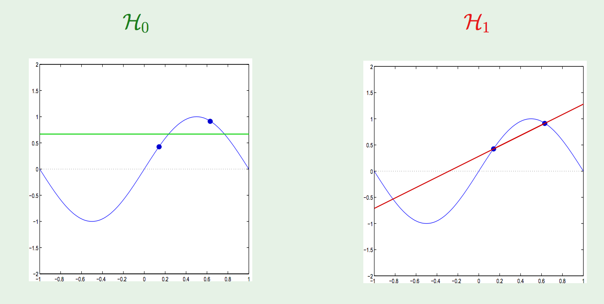
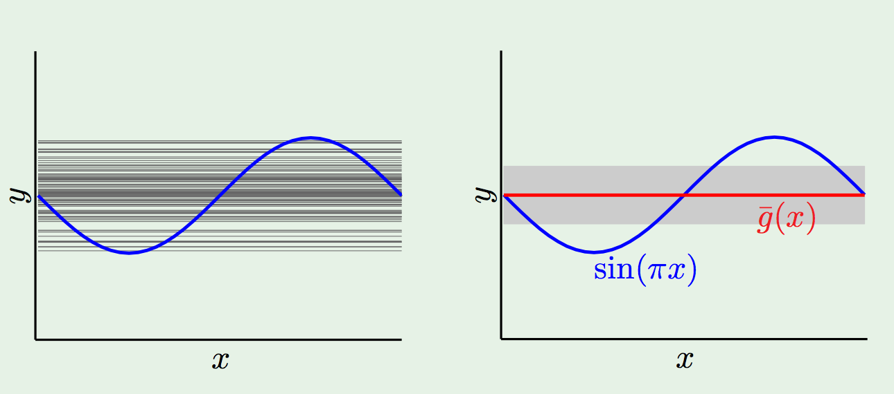
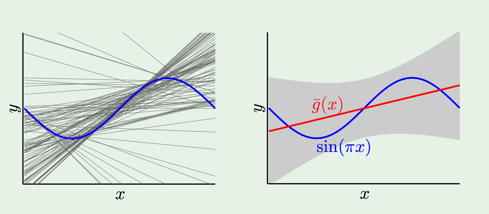

# Last Time

Last time we discussed several things, mostly in the context of linear regression.

## Goodness of Fit

The general problem of having notions of *"Goodness of Fit"* for linear models, which allows us to . Given a function $f(x)$ that we are trying to approximate, there are generally a variety of hypotheses that we might try to fit to the data, at the very least coming from the variety of choices that we have for the construction of our feature space $X$ (e.g. we can use a feature that is `Sepal.Width`, `log(Sepal.Width)`, `Sepal.Width*Sepal.Length`, and so on). 

Because of the variety of these choices, we need some way of comparing hypotheses. In addition, those comparisons should speak to the actual objective we are trying to achieve: the accurate approximation of $f(x)$ for the purpose of getting good predictions on unseen data points. 

In addition, we described a couple  

## Correlation and Variance

We defined *covariance*, *variance*, the *standard deviation* and *correlation*. These are ways of describing how variables vary with one-another (or themselves, in the case of the variance and standard deviation). This descrption of variation is a linear one, which describes if two random variables are **linearly** related to one-another. 

## Overfitting

Finally, we described the problem of *overfitting*, which comes from the ability of our model training process to find spurious patterns in training data in the course of trying to achieve its training objective. 

```{r}
library(ggplot2)
library(dplyr)
library(GGally)
library(ggthemes)
theme_set(ggthemes::theme_tufte())
sample_data <- data.frame(x=seq(1,100,10), y=sapply(seq(1,100,10), function(x) 3+5*x+x^2 + rnorm(1, sd = 1000)))
pl1 <- sample_data %>% ggplot(aes(x=x,y=y)) + geom_smooth(method="lm", se=FALSE) + geom_point()
pl2 <- sample_data %>% ggplot(aes(x=x,y=y)) + geom_smooth(method="lm", formula=y ~ poly(x,2), se=FALSE) + geom_point()
pl3 <- sample_data %>% ggplot(aes(x=x,y=y)) + geom_smooth(method="lm", formula=y ~ poly(x,8), se=FALSE) + geom_point()
ggmatrix(list(pl1,pl2,pl3), 3,1, yAxisLabels = c("Underfitting", "Fitting", "Overfitting"), 
         title="Types of Fit",   showYAxisPlotLabels = FALSE)
```

# Overfitting (pt. 2)

In general, as we increase the complexity of models, their training error will decrease. 

```{r}
sample_data <- data.frame(x=seq(1,1000,10), y=sapply(seq(1,1000,10), function(x) 3+5*x+x^2+5*x^3-2*x^4 + rnorm(1, sd = 1000)))
models <- lapply(1:200, function(d) lm(Sepal.Length ~ poly(x = Sepal.Width, degree = d, raw=TRUE), data=iris))
mses <- sapply(models, function(x) mean(abs(x$residuals)))
qplot(x=1:200, y =mses, geom="line") + xlab("Complexity") + ylab("Error")
```

At the same time, the error on a testing set will generally follow a pattern of 

* Decreasing as we increase to the "correct" or "best" model complexity
* Increasing as we make the model too complex, and potentially hitting an asymptote

```{r}
library(caret)
iris_train_index <- createDataPartition(1:nrow(iris), list=FALSE, p=.8)
iris_train <- iris[iris_train_index, ]
iris_test <- iris[-iris_train_index, ]
models <- lapply(1:30, function(d) lm(Sepal.Length ~ poly(x = Sepal.Width, degree = d, raw=TRUE), data=iris_train))
test_mses <- sapply(models, function(x) mean(abs(iris_test$Sepal.Length - predict(x, iris_test)[[1]])))
train_mses <- sapply(models, function(x) mean(abs(x$residuals)))
qplot(x=1:30, y =test_mses, geom="line") + xlab("Complexity") + ylab("Test Error")
```

```{r}
train_df <- data.frame(x=1:30, y = train_mses, type="train")
test_df <- data.frame(x=1:30, y = test_mses, type="test")
bind_rows(train_df,test_df) %>% ggplot(aes(x=x,y=y, color=type)) + geom_line() 
```

# Bias-Variance

This problem is coming from a more general phenomenon known as the *Bias-Variance Tradeoff*. Let's set it up. We have:

* Some real-valued function $f$ that we are looking to approximate (we will use the mean-squared error/loss function);
* Some collection of hypotheses $H$ that we are considering (e.g. linear hypotheses) as candidates for approximations of $f$
* Have an expected "out-of-sample" error that corresponds to how a given hypothesis performs on "unseen" data (e.g. testing set error), call this $E_{out}$. This is an expectation over all possible choices of testing/training data.
* Have an expected "in-sample" error that corresponds to how a given hypothesis performs on training data (e.g. our loss function $L$ for linear regression), call this $E_{in}$. This is an expectation over all possible choices of testing/training data.

*In General*

* More complex $H$ => better chance of *approximating $f$*
 
* Less complex $H$ => better chance of *generalizing* out of sample

* Ideally: $H = \{ f\}$, but that will surely never happen!

## Quantifying the tradeoff

We are going to decompose the expected out-of-sample error into two components: *bias* and *variance*. These two components correspond to:

* How well $H$ can approximate $f$ in a best-case scenario. This is called the *bias*, and speaks to the inherent, built-in error that comes from using a particular set of hypotheses that may or may not contain $f$ or contain hypotheses that are similar to $f$. 
* How well we can find a good $h \in H$, given some collection of training data. This is called the variance, which speaks to the variation in the choices of "best" $h \in H$ as we try to minimize the training error over difference choices of the training data set. 

More setup: 

* We make explicit the choice of training set in the determiniation of minimal error $h \in H$, so we will let $T$ be the training set, and think of $h$ as a function of $T$. Then we write 

$$ h(T) = \text{the } h \in H \text{ for which training error is minimized over } T$$

* We assume that there is a probability distribution over possible (finite, of course) training sets. We will generally choose this distribution so that all training sets are equally likely.

* We assume that there is a probability distribution over all inputs to the hypothesis function. We are generally considering functions on some bounded subset of $\mathbb{R}$, so we can take a uniform distribution that makes all points equally likely. 

Let $x$ be some input point in the domain of the hypotheses in $H$, with a known value $f(x)$. Then the out of sample error at $x$ for a given hypothesis $h(T)$ is simply

$$(h(T) - f(x))^2.$$

If we average this over all sample points $x$, we get the expected out of sample error for $h(T)$:

$$E_{out}(h(T)) := \mathbb{E}_x \left[ (h(T) - f(x))^2 \right].$$

This is just (2x) the average of $L$ over all possible testing points. To look at the "global" behavior of $H$, we take an expectation over all possible choices of training set $T$:

$$
\begin{eqnarray}
\mathbb{E}_{T} \left[ E_{out}(h(T)) \right] &=& \mathbb{E}_T \left[ \mathbb{E}_x \left[ (h(T) - f(x))^2 \right] \right] \\
&=& \mathbb{E}_x \left[ \mathbb{E}_T \left[ (h(T) - f(x))^2 \right] \right] \\
\end{eqnarray}
$$

We can change the order of integration here under reasonable hypotheses. 

Let's look at the inside term $\left[ (h(T) - f(x))^2 \right]$.

To evaluate the inside here we define the *average hypothesis* $\bar{h}(x)$, which is defined at a point by 

$$\bar{h}(x) := \mathbb{E}_{T}\left[ h(T) (x) \right] .$$

If we imagine that there are many, many training sets $T_1, T_2, \dots, T_k$, then 

$$\bar{h}(x) \approx \frac{1}{k} \sum_{i=1}^k h(T_i)(x)$$

This represents the "best" that we can get out of using $H$, as we are taking an average over an *infinite* number of possible training sets to inform our choice of final hypothesis. In reality, we only have access to a *single* piece of data with which to construct our training data.

$$
\begin{eqnarray}
\left[ (h(T) - f(x))^2 \right] &=& \mathbb{E}_T \left[ (h(T)(x) - \bar{h}(x) + \bar{h}(x) - f(x))^2 \right] \\
&=&  \mathbb{E}_T [(h(T)(x) - \bar{h}(x))^2 + (\bar{h}(x) - f(x))^2 +  \\
&& 2 (\bar{h}(x) - f(x))(h(T)(x)) ]\\
&=&  \mathbb{E}_T \left[ (h(T)(x) - \bar{h}(x))^2 + (\bar{h}(x) - f(x))^2\right]
\end{eqnarray}
$$

The last term vanishes because of the definition of $\bar{h}(x)$. 

The second term is a constant with respect to $T$, so we can write this as 

$$
\begin{eqnarray}
\mathbb{E}_T \left[ (h(T)(x) - \bar{h}(x))^2 + (\bar{h}(x) - f(x))^2\right] &=& \mathbb{E}_T \left[ (h(T)(x) - \bar{h}(x))^2\right] + (\bar{h}(x) - f(x))^2 \\
&=&  \text{var}(x)  + \text{bias}(x)
\end{eqnarray}
$$

Taking an expectation over $x$, we get 

$$\mathbb{E}_{T} \left[ E_{out}(h(T)) \right] = \mathbb{E}_x \left[ \text{var}(x) + \text{bias} (x) \right]$$

So, the expected average out-of-sample error over all possible training sets has a decomposition into these two components. 

$$\text{bias} := \mathbb{E}_x (\bar{h}(x) - f(x))^2  \qquad \text{var} := \left[ (h(T)(x) - \bar{h}(x))^2\right] $$


In general, these two components play off one-another, which is the underlying cause of the complexity/training set performance tradeoff we saw before. 

Example: Fitting a sinusoid. 

$f: [-1,-1] \rightarrow \mathbb{R} \qquad f(x) = \sin(\pi x)$.

Only use 2 training examples, with two hypothesis sets used for learning:

$$H_0 : h(x) = b$$
$$H_1 : h(x) = ax+ b$$.

Which is better?


The expected out of sample error is just given by the integral over $[-1,1]$ of the difference between the fit line and $x$, which is .5 for $H_0$ and $.2$ for $H_1$. 

These particular hypotheses turn out to be the average hypotheses. 

Now, how does this perform for particular choices of two data points?



Sampling a lot of pairs of data points gives us a distribution of fit hypotheses for both $H_0$ and $H_1$. 





So, which one wins? 


