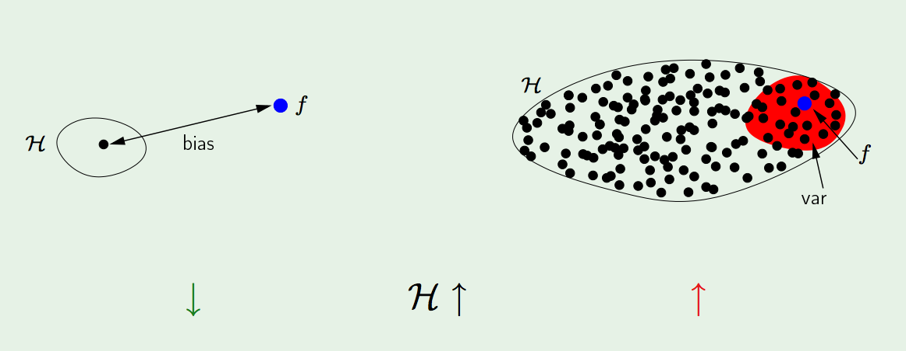
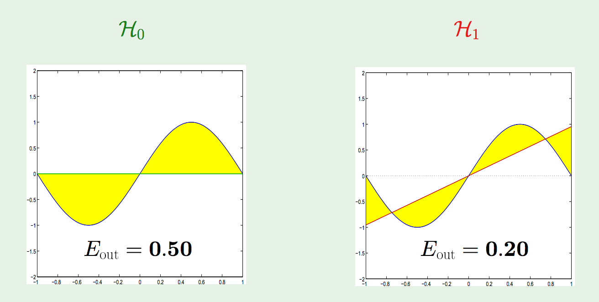
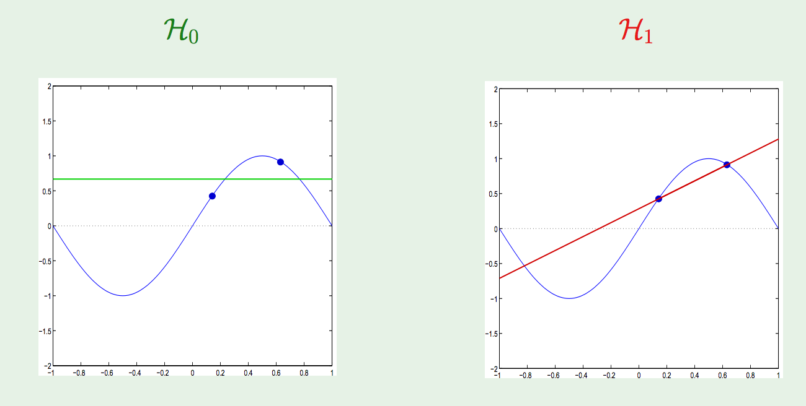
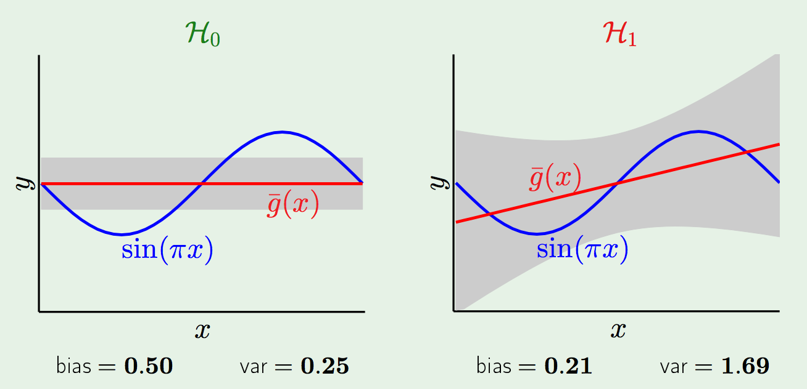

  
# Last Time
  
* Talked about the *Bias-Variance Decomposition/Tradeoff* and how our problems with overfitting could be a manifestation of that tradeoff.

# Bias-Variance (take II):

Our setup is:

* Some real-valued function $f$ that we are looking to approximate (we will use the mean-squared error/loss function);
* Some collection of hypotheses $H$ that we are considering (e.g. linear hypotheses) as candidates for approximations of $f$
* Have an expected "out-of-sample" error that corresponds to how a given hypothesis performs on "unseen" data (e.g. testing set error), call this $E_{out}$. This is an expectation over all possible choices of testing data.

To be clear, $E_{out}$ is the average out-of-sample error: 

$$E_{out}(h) = \mathbb{E}_x [(f(x) - h(x))^2] $$

where the expectation is taken over all possible choices of $x$ that we could test. We generally don't know this quantity, because we'd have to know all of the possible values of $f(x)$, in which case we'd just be able to write down what $f$ is. 

* Have an expected "in-sample" error that corresponds to how a given hypothesis performs on training data (e.g. our loss function $L$ for linear regression), call this $E_{in}$. This is an expectation over all possible choices of training data.

*In General*

* More complex $H$ => better chance of *approximating $f$*

* Less complex $H$ => better chance of *generalizing* out of sample

* Ideally: $H = \{ f\}$, but that will surely never happen!

## Quantifying the tradeoff

We are going to decompose the expected out-of-sample error into two components: *bias* and *variance*. These two components correspond to:

* How well $H$ can approximate $f$ in a best-case scenario. This is called the *bias*, and speaks to the inherent, built-in error that comes from using a particular set of hypotheses that may or may not contain $f$ or contain hypotheses that are similar to $f$. 
* How well we can find a good $h \in H$, given some collection of training data. This is called the variance, which speaks to the variation in the choices of "best" $h \in H$ as we try to minimize the training error over difference choices of the training data set. 

More setup: 

* We make explicit the choice of training set in the determiniation of minimal error $h \in H$, so we will let $T$ be the training set, and think of $h$ as a function of $T$. Then we write 

$$ h(T) = \text{the } h \in H \text{ for which training error is minimized over } T$$

* We assume that there is a probability distribution over possible (finite, of course) training sets. We will generally choose this distribution so that all training sets are equally likely.

* We assume that there is a probability distribution over all inputs to the hypothesis function. We are generally considering functions on some bounded subset of $\mathbb{R}$, so we can take a uniform distribution that makes all points equally likely. 

Let $x$ be some input point in the domain of the hypotheses in $H$, with a known value $f(x)$. Then the out of sample error at $x$ for a given hypothesis $h(T)$ is simply

$$(h(T) - f(x))^2.$$

If we average this over all sample points $x$, we get the expected out of sample error for $h(T)$:

$$E_{out}(h(T)) := \mathbb{E}_x \left[ (h(T) - f(x))^2 \right].$$

This is just (2x) the average of $L$ over all possible testing points. To look at the "global" behavior of $H$, we take an expectation over all possible choices of training set $T$:

$$
\begin{eqnarray}
\mathbb{E}_{T} \left[ E_{out}(h(T)) \right] &=& \mathbb{E}_T \left[ \mathbb{E}_x \left[ (h(T) - f(x))^2 \right] \right] \\
&=& \mathbb{E}_x \left[ \mathbb{E}_T \left[ (h(T) - f(x))^2 \right] \right] \\
\end{eqnarray}
$$

We can change the order of integration here under reasonable hypotheses. 

Let's look at the inside term $\left[ (h(T) - f(x))^2 \right]$.

To evaluate the inside here we define the *average hypothesis* $\bar{h}(x)$, which is defined at a point by 

$$\bar{h}(x) := \mathbb{E}_{T}\left[ h(T) (x) \right] .$$
  
  If we imagine that there are many, many training sets $T_1, T_2, \dots, T_k$, then 

$$\bar{h}(x) \approx \frac{1}{k} \sum_{i=1}^k h(T_i)(x)$$
  
  This represents the "best" that we can get out of using $H$, as we are taking an average over an *infinite* number of possible training sets to inform our choice of final hypothesis. In reality, we only have access to a *single* piece of data with which to construct our training data.

$$
  \begin{eqnarray}
\left[ (h(T) - f(x))^2 \right] &=& \mathbb{E}_T \left[ (h(T)(x) - \bar{h}(x) + \bar{h}(x) - f(x))^2 \right] \\
&=&  \mathbb{E}_T [(h(T)(x) - \bar{h}(x))^2 + (\bar{h}(x) - f(x))^2 +  \\
                   && 2 (\bar{h}(x) - f(x))(h(T)(x)) ]\\
&=&  \mathbb{E}_T \left[ (h(T)(x) - \bar{h}(x))^2 + (\bar{h}(x) - f(x))^2\right]
\end{eqnarray}
$$
  
  The last term vanishes because of the definition of $\bar{h}(x)$. 

The second term is a constant with respect to $T$, so we can write this as 

$$
  \begin{eqnarray}
\mathbb{E}_T \left[ (h(T)(x) - \bar{h}(x))^2 + (\bar{h}(x) - f(x))^2\right] &=& \mathbb{E}_T \left[ (h(T)(x) - \bar{h}(x))^2\right] + (\bar{h}(x) - f(x))^2 \\
&=&  \text{var}(x)  + \text{bias}(x)
\end{eqnarray}
$$
  
  Taking an expectation over $x$, we get 

$$\mathbb{E}_{T} \left[ E_{out}(h(T)) \right] = \mathbb{E}_x \left[ \text{var}(x) + \text{bias} (x) \right]$$
  
  So, the expected average out-of-sample error over all possible training sets has a decomposition into these two components. 

$$\text{bias} := \mathbb{E}_x (\bar{h}(x) - f(x))^2  \qquad \text{var} := \left[ (h(T)(x) - \bar{h}(x))^2\right] $$
  
  

In general, these two components play off one-another, which is the underlying cause of the complexity/training set performance tradeoff we saw before. 

Example: Fitting a sinusoid. 

$f: [-1,-1] \rightarrow \mathbb{R} \qquad f(x) = \sin(\pi x)$.

Only use 2 training examples, with two hypothesis sets used for learning:
  
  $$H_0 : h(x) = b$$
  $$H_1 : h(x) = ax+ b$$.

Which is better?
  
  

The expected out of sample error is just given by the integral over $[-1,1]$ of the difference between the fit line and $x$, which is .5 for $H_0$ and $.2$ for $H_1$. 

These particular hypotheses turn out to be the average hypotheses. 

Now, how does this perform for particular choices of two data points?
  
  

Sampling a lot of pairs of data points gives us a distribution of fit hypotheses for both $H_0$ and $H_1$. 

```{r}
library(ggplot2)
library(dplyr)
library(GGally)
library(ggthemes)
theme_set(ggthemes::theme_tufte())
sine_x <- seq(0,1,by = .01)
sine_y <- sapply(sine_x, function(x) sin(2*pi*x))

const_samples <- function(n=1000){
  pt1 <- sapply(runif(n), function(x) sin(2*pi*x))
  pt2 <- sapply(runif(n), function(x) sin(2*pi*x))
  best_const_line <- (pt1+pt2 / 2) 
  best_const_line
}
const_sample_df <- data.frame(yint=const_samples(10000))
ggplot(aes(x=x,y=y), data=data.frame(x=sine_x,y=sine_y)) + geom_smooth() + geom_hline(aes(yintercept=yint), data =const_sample_df , alpha = .005) + geom_hline(yintercept = mean(const_sample_df$yint), color="red") + ylim(-5,5) + ylab(expression(sin(pi* x)))
```
```{r}
line_samples <- function(n=10000)
{
    x1s <- runif(n)
    x2s <- runif(n)
    pt1 <- sapply(x1s, function(x) sin(2*pi*x))
    pt2 <- sapply(x2s, function(x) sin(2*pi*x))
    slopes <- (pt1-pt2) / (x1s - x2s)
    yints <- (pt1 - slopes*x1s)
    return(data.frame(slopes=slopes,yints=yints))
}
line_data <- line_samples()
ggplot(aes(x=x,y=y), data=data.frame(x=sine_x,y=sine_y)) + geom_abline(aes(intercept=yints, slope=slopes), data =line_data , alpha = .005) + geom_abline(slope = mean(line_data$slopes),intercept = mean(line_data$yints), color="red") + geom_smooth() + ylim(c(-5,5)) + ylab(expression(sin(pi* x)))
```

So, which one wins? 
  

